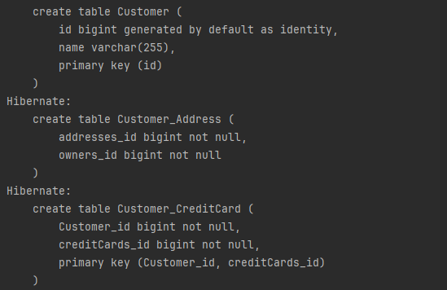
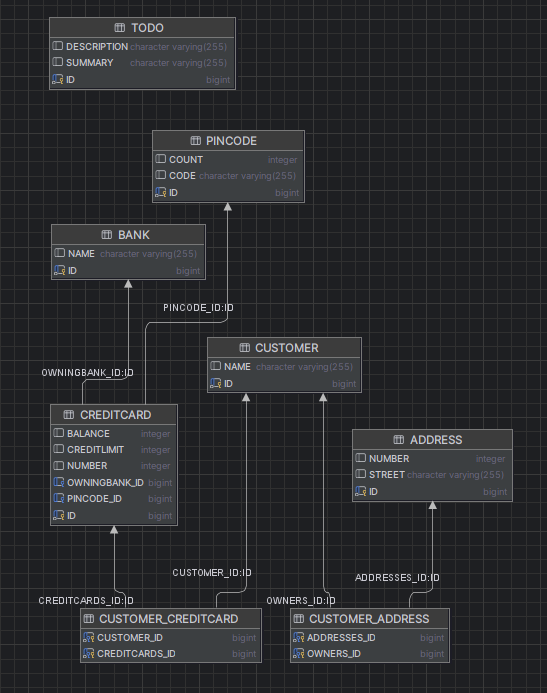
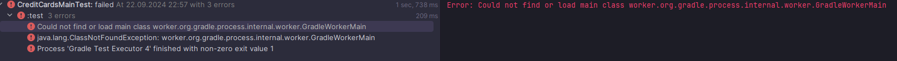
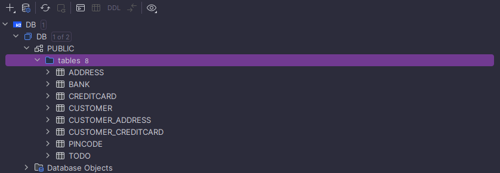

# Questions
- Explain the used database and how/when it runs.
  - The database is an H2 database and is defined in ``persistence.xml``. The database
    schema is automatically generated based on the JPA entity annotations and the tables are created
    when the ``EntityManager`` is initialized.
- Can you provide the SQL used to create the table Customer?
  
- Find a way to inspect the database tables being created and create a database schema in your report. Do the created tables correspond to your initial thoughts regarding the exercise?
  

- technical problems that you encountered during installation and use of Java Persistence Architecture (JPA) and how you resolved
  - Had some problems with running the files in the correct sdk version. Furthermore I have issues
    when running the file with gradle and I am getting an error message that I cannot resolve. Most likely going to factory reset pc so that
    the issue dissapears (see image)

  
- a link to your code for experiment 2 above. Make sure the included test case passes!
  - https://github.com/kristofferwaagen/dat250-exercise4/tree/d0faa16ffa80ad56eaba210850b69cea920111ee
- an explanation of how you inspected the database tables and what tables were created. For the latter, you may provide screenshots.
  - I inspected the database tables by using Intellij's database viewer where I loaded the ``DB.mv.db`` file
    
- any pending issues with this assignment that you did not manage to solve
  - The issues I have with java and gradle, but will figure these out by reseting my pc