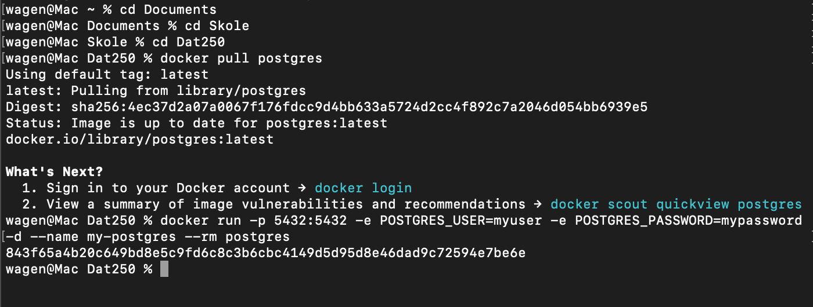
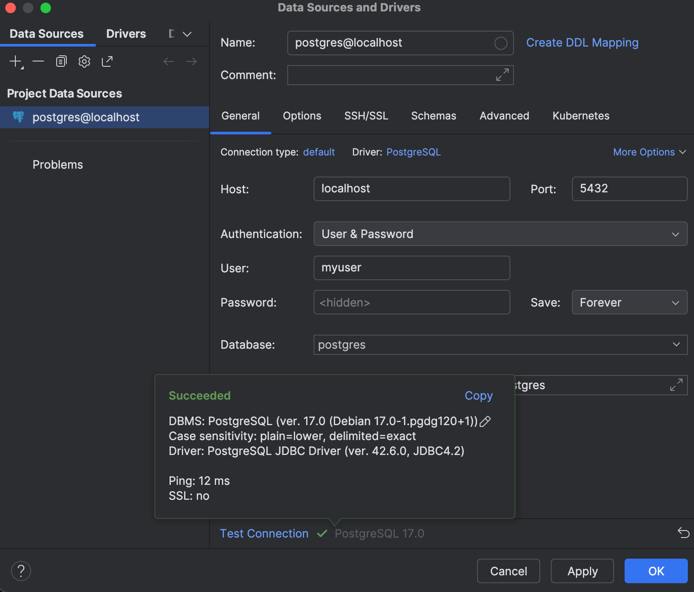
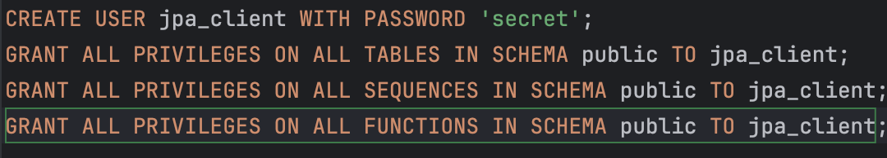

## Assignemnt 7

### First Exercise: Can you find out what `-p` and `-e` arguments you have to pass to the `docker run` command?

`-p` argument should be 5543 since PostgreSQL has this as default port

`-e` should be the environment variables sent in such as user, password and database


### For connecting to PostgreSQL (Task 1):

To connect I did the following:


To check if the connection worked I added a PostgreSQL database in Intellij database handler and tested the connection:


I made a user for jpa_client with the following syntax:


When trying to run the tests after creating a user, changing from H2 to postgres by adding the required code to ``build.gradle.kts``
and ``persistence.xml`` I get these errors:

```
wagen@Mac exercise4 % gradle run
> Task :run FAILED
Oct 15, 2024 11:05:56 PM org.hibernate.jpa.internal.util.LogHelper logPersistenceUnitInformation
INFO: HHH000204: Processing PersistenceUnitInfo [name: jpa-tutorial]
Oct 15, 2024 11:05:57 PM org.hibernate.Version logVersion
INFO: HHH000412: Hibernate ORM core version 6.6.0.Final
Oct 15, 2024 11:05:57 PM org.hibernate.cache.internal.RegionFactoryInitiator initiateService
INFO: HHH000026: Second-level cache disabled
Oct 15, 2024 11:05:57 PM org.hibernate.engine.jdbc.connections.internal.DriverManagerConnectionProviderImpl configure
WARN: HHH10001002: Using built-in connection pool (not intended for production use)
Oct 15, 2024 11:05:57 PM org.hibernate.engine.jdbc.dialect.internal.DialectFactoryImpl constructDialect
WARN: HHH90000025: PostgreSQLDialect does not need to be specified explicitly using 'hibernate.dialect' (remove the property setting and it will be selected by default)
Oct 15, 2024 11:05:57 PM org.hibernate.engine.jdbc.env.internal.JdbcEnvironmentInitiator initiateService
INFO: HHH10001005: Database info:
Database JDBC URL [jdbc:postgresql://127.0.0.1:5432/postgres]
Database driver: org.postgresql.Driver
Database version: 17.0
Autocommit mode: false
Isolation level: undefined/unknown
Minimum pool size: 1
Maximum pool size: 1
Oct 15, 2024 11:05:58 PM org.hibernate.engine.transaction.jta.platform.internal.JtaPlatformInitiator initiateService
INFO: HHH000489: No JTA platform available (set 'hibernate.transaction.jta.platform' to enable JTA platform integration)
Hibernate:
select
t1_0.id,
t1_0.description,
t1_0.summary
from
Todo t1_0
Oct 15, 2024 11:05:58 PM org.hibernate.engine.jdbc.spi.SqlExceptionHelper logExceptions
WARN: SQL Error: 0, SQLState: 42P01
Oct 15, 2024 11:05:58 PM org.hibernate.engine.jdbc.spi.SqlExceptionHelper logExceptions
ERROR: ERROR: relation "todo" does not exist
Position: 51
Exception in thread "main" org.hibernate.exception.SQLGrammarException: JDBC exception executing SQL [select t1_0.id,t1_0.description,t1_0.summary from Todo t1_0] [ERROR: relation "todo" does not exist
Position: 51] [n/a]
at org.hibernate.exception.internal.SQLStateConversionDelegate.convert(SQLStateConversionDelegate.java:91)
at org.hibernate.exception.internal.StandardSQLExceptionConverter.convert(StandardSQLExceptionConverter.java:58)
at org.hibernate.engine.jdbc.spi.SqlExceptionHelper.convert(SqlExceptionHelper.java:108)
at org.hibernate.engine.jdbc.spi.SqlExceptionHelper.convert(SqlExceptionHelper.java:94)
at org.hibernate.sql.results.jdbc.internal.DeferredResultSetAccess.executeQuery(DeferredResultSetAccess.java:268)
at org.hibernate.sql.results.jdbc.internal.DeferredResultSetAccess.getResultSet(DeferredResultSetAccess.java:171)
at org.hibernate.sql.results.jdbc.internal.JdbcValuesResultSetImpl.<init>(JdbcValuesResultSetImpl.java:74)
at org.hibernate.sql.exec.internal.JdbcSelectExecutorStandardImpl.resolveJdbcValuesSource(JdbcSelectExecutorStandardImpl.java:355)
at org.hibernate.sql.exec.internal.JdbcSelectExecutorStandardImpl.doExecuteQuery(JdbcSelectExecutorStandardImpl.java:137)
at org.hibernate.sql.exec.internal.JdbcSelectExecutorStandardImpl.executeQuery(JdbcSelectExecutorStandardImpl.java:102)
at org.hibernate.sql.exec.spi.JdbcSelectExecutor.executeQuery(JdbcSelectExecutor.java:91)
at org.hibernate.sql.exec.spi.JdbcSelectExecutor.list(JdbcSelectExecutor.java:165)
at org.hibernate.query.sqm.internal.ConcreteSqmSelectQueryPlan.lambda$new$1(ConcreteSqmSelectQueryPlan.java:152)
at org.hibernate.query.sqm.internal.ConcreteSqmSelectQueryPlan.withCacheableSqmInterpretation(ConcreteSqmSelectQueryPlan.java:442)
at org.hibernate.query.sqm.internal.ConcreteSqmSelectQueryPlan.performList(ConcreteSqmSelectQueryPlan.java:362)
at org.hibernate.query.sqm.internal.QuerySqmImpl.doList(QuerySqmImpl.java:380)
at org.hibernate.query.spi.AbstractSelectionQuery.list(AbstractSelectionQuery.java:136)
at org.hibernate.query.Query.getResultList(Query.java:120)
at no.hvl.dat250.jpa.tutorial.basicexample.Main.readAndPrintTodos(Main.java:36)
at no.hvl.dat250.jpa.tutorial.basicexample.Main.main(Main.java:19)
Caused by: org.postgresql.util.PSQLException: ERROR: relation "todo" does not exist
Position: 51
at org.postgresql.core.v3.QueryExecutorImpl.receiveErrorResponse(QueryExecutorImpl.java:2733)
at org.postgresql.core.v3.QueryExecutorImpl.processResults(QueryExecutorImpl.java:2420)
at org.postgresql.core.v3.QueryExecutorImpl.execute(QueryExecutorImpl.java:372)
at org.postgresql.jdbc.PgStatement.executeInternal(PgStatement.java:517)
at org.postgresql.jdbc.PgStatement.execute(PgStatement.java:434)
at org.postgresql.jdbc.PgPreparedStatement.executeWithFlags(PgPreparedStatement.java:194)
at org.postgresql.jdbc.PgPreparedStatement.executeQuery(PgPreparedStatement.java:137)
at org.hibernate.sql.results.jdbc.internal.DeferredResultSetAccess.executeQuery(DeferredResultSetAccess.java:250)
... 15 more

FAILURE: Build failed with an exception.

* What went wrong:
  Execution failed for task ':run'.
> Process 'command '/Users/wagen/.sdkman/candidates/java/21.0.4-tem/bin/java'' finished with non-zero exit value 1

* Try:
> Run with --stacktrace option to get the stack trace.
> Run with --info or --debug option to get more log output.
> Run with --scan to get full insights.
> Get more help at https://help.gradle.org.
```

```
> Task :compileJava UP-TO-DATE
> Task :processResources UP-TO-DATE
> Task :classes UP-TO-DATE
> Task :compileTestJava UP-TO-DATE
> Task :processTestResources NO-SOURCE
> Task :testClasses UP-TO-DATE
Oct 15, 2024 11:13:52 PM org.hibernate.jpa.internal.util.LogHelper logPersistenceUnitInformation
INFO: HHH000204: Processing PersistenceUnitInfo [name: jpa-tutorial]
Oct 15, 2024 11:13:52 PM org.hibernate.Version logVersion
INFO: HHH000412: Hibernate ORM core version 6.6.0.Final
Oct 15, 2024 11:13:52 PM org.hibernate.cache.internal.RegionFactoryInitiator initiateService
INFO: HHH000026: Second-level cache disabled
Oct 15, 2024 11:13:53 PM org.hibernate.engine.jdbc.connections.internal.DriverManagerConnectionProviderImpl configure
WARN: HHH10001002: Using built-in connection pool (not intended for production use)
Oct 15, 2024 11:13:53 PM org.hibernate.engine.jdbc.dialect.internal.DialectFactoryImpl constructDialect
WARN: HHH90000025: PostgreSQLDialect does not need to be specified explicitly using 'hibernate.dialect' (remove the property setting and it will be selected by default)
Oct 15, 2024 11:13:53 PM org.hibernate.engine.jdbc.env.internal.JdbcEnvironmentInitiator initiateService
INFO: HHH10001005: Database info:
	Database JDBC URL [jdbc:postgresql://127.0.0.1:5432/postgres]
	Database driver: org.postgresql.Driver
	Database version: 17.0
	Autocommit mode: false
	Isolation level: undefined/unknown
	Minimum pool size: 1
	Maximum pool size: 1
Oct 15, 2024 11:13:54 PM org.hibernate.engine.transaction.jta.platform.internal.JtaPlatformInitiator initiateService
INFO: HHH000489: No JTA platform available (set 'hibernate.transaction.jta.platform' to enable JTA platform integration)
Oct 15, 2024 11:13:54 PM org.hibernate.jpa.internal.util.LogHelper logPersistenceUnitInformation
INFO: HHH000204: Processing PersistenceUnitInfo [name: jpa-tutorial]
Oct 15, 2024 11:13:54 PM org.hibernate.cache.internal.RegionFactoryInitiator initiateService
INFO: HHH000026: Second-level cache disabled
Oct 15, 2024 11:13:54 PM org.hibernate.engine.jdbc.connections.internal.DriverManagerConnectionProviderImpl configure
WARN: HHH10001002: Using built-in connection pool (not intended for production use)
Oct 15, 2024 11:13:54 PM org.hibernate.engine.jdbc.dialect.internal.DialectFactoryImpl constructDialect
WARN: HHH90000025: PostgreSQLDialect does not need to be specified explicitly using 'hibernate.dialect' (remove the property setting and it will be selected by default)
Oct 15, 2024 11:13:54 PM org.hibernate.engine.jdbc.env.internal.JdbcEnvironmentInitiator initiateService
INFO: HHH10001005: Database info:
	Database JDBC URL [jdbc:postgresql://127.0.0.1:5432/postgres]
	Database driver: org.postgresql.Driver
	Database version: 17.0
	Autocommit mode: false
	Isolation level: undefined/unknown
	Minimum pool size: 1
	Maximum pool size: 1
Oct 15, 2024 11:13:54 PM org.hibernate.engine.transaction.jta.platform.internal.JtaPlatformInitiator initiateService
INFO: HHH000489: No JTA platform available (set 'hibernate.transaction.jta.platform' to enable JTA platform integration)
Hibernate: 
    insert 
    into
        Address
        (number, street) 
    values
        (?, ?) 
    returning id
Oct 15, 2024 11:13:54 PM org.hibernate.engine.jdbc.spi.SqlExceptionHelper logExceptions
WARN: SQL Error: 0, SQLState: 42P01
Oct 15, 2024 11:13:54 PM org.hibernate.engine.jdbc.spi.SqlExceptionHelper logExceptions
ERROR: ERROR: relation "address" does not exist
  Position: 13

could not execute statement [ERROR: relation "address" does not exist
  Position: 13] [insert into Address (number,street) values (?,?) returning id]
org.hibernate.exception.SQLGrammarException: could not execute statement [ERROR: relation "address" does not exist
  Position: 13] [insert into Address (number,street) values (?,?) returning id]
	at org.hibernate.exception.internal.SQLStateConversionDelegate.convert(SQLStateConversionDelegate.java:91)
	at org.hibernate.exception.internal.StandardSQLExceptionConverter.convert(StandardSQLExceptionConverter.java:58)
	at org.hibernate.engine.jdbc.spi.SqlExceptionHelper.convert(SqlExceptionHelper.java:108)
	at org.hibernate.engine.jdbc.internal.ResultSetReturnImpl.execute(ResultSetReturnImpl.java:145)
	at org.hibernate.id.insert.InsertReturningDelegate.executeAndExtractReturning(InsertReturningDelegate.java:96)
	at org.hibernate.id.insert.AbstractReturningDelegate.performMutation(AbstractReturningDelegate.java:58)
	at org.hibernate.engine.jdbc.mutation.internal.MutationExecutorSingleNonBatched.performNonBatchedOperations(MutationExecutorSingleNonBatched.java:47)
	at org.hibernate.engine.jdbc.mutation.internal.AbstractMutationExecutor.execute(AbstractMutationExecutor.java:55)
	at org.hibernate.persister.entity.mutation.InsertCoordinatorStandard.doStaticInserts(InsertCoordinatorStandard.java:194)
	at org.hibernate.persister.entity.mutation.InsertCoordinatorStandard.coordinateInsert(InsertCoordinatorStandard.java:132)
	at org.hibernate.persister.entity.mutation.InsertCoordinatorStandard.insert(InsertCoordinatorStandard.java:95)
	at org.hibernate.action.internal.EntityIdentityInsertAction.execute(EntityIdentityInsertAction.java:85)
	at org.hibernate.engine.spi.ActionQueue.execute(ActionQueue.java:682)
	at org.hibernate.engine.spi.ActionQueue.addResolvedEntityInsertAction(ActionQueue.java:293)
	at org.hibernate.engine.spi.ActionQueue.addInsertAction(ActionQueue.java:274)
	at org.hibernate.engine.spi.ActionQueue.addAction(ActionQueue.java:324)
	at org.hibernate.event.internal.AbstractSaveEventListener.addInsertAction(AbstractSaveEventListener.java:393)
	at org.hibernate.event.internal.AbstractSaveEventListener.performSaveOrReplicate(AbstractSaveEventListener.java:307)
	at org.hibernate.event.internal.AbstractSaveEventListener.performSave(AbstractSaveEventListener.java:223)
	at org.hibernate.event.internal.AbstractSaveEventListener.saveWithGeneratedId(AbstractSaveEventListener.java:136)
	at org.hibernate.event.internal.DefaultPersistEventListener.entityIsTransient(DefaultPersistEventListener.java:177)
	at org.hibernate.event.internal.DefaultPersistEventListener.persist(DefaultPersistEventListener.java:95)
	at org.hibernate.event.internal.DefaultPersistEventListener.onPersist(DefaultPersistEventListener.java:79)
	at org.hibernate.event.internal.DefaultPersistEventListener.onPersist(DefaultPersistEventListener.java:55)
	at org.hibernate.event.service.internal.EventListenerGroupImpl.fireEventOnEachListener(EventListenerGroupImpl.java:127)
	at org.hibernate.internal.SessionImpl.firePersist(SessionImpl.java:761)
	at org.hibernate.internal.SessionImpl.persist(SessionImpl.java:745)
	at no.hvl.dat250.jpa.tutorial.creditcards.driver.CreditCardsMain.createObjects(CreditCardsMain.java:57)
	at no.hvl.dat250.jpa.tutorial.creditcards.driver.CreditCardsMain.main(CreditCardsMain.java:18)
	at no.hvl.dat250.jpa.tutorial.creditcards.driver.CreditCardsMainTest.testDomainModelPersistence(CreditCardsMainTest.java:30)
	at java.base/java.lang.reflect.Method.invoke(Method.java:580)
	at java.base/java.util.ArrayList.forEach(ArrayList.java:1596)
	at java.base/java.util.ArrayList.forEach(ArrayList.java:1596)
Caused by: org.postgresql.util.PSQLException: ERROR: relation "address" does not exist
  Position: 13
	at org.postgresql.core.v3.QueryExecutorImpl.receiveErrorResponse(QueryExecutorImpl.java:2733)
	at org.postgresql.core.v3.QueryExecutorImpl.processResults(QueryExecutorImpl.java:2420)
	at org.postgresql.core.v3.QueryExecutorImpl.execute(QueryExecutorImpl.java:372)
	at org.postgresql.jdbc.PgStatement.executeInternal(PgStatement.java:517)
	at org.postgresql.jdbc.PgStatement.execute(PgStatement.java:434)
	at org.postgresql.jdbc.PgPreparedStatement.executeWithFlags(PgPreparedStatement.java:194)
	at org.postgresql.jdbc.PgPreparedStatement.execute(PgPreparedStatement.java:180)
	at org.hibernate.engine.jdbc.internal.ResultSetReturnImpl.execute(ResultSetReturnImpl.java:129)
	... 29 more


ERROR: relation "address" does not exist
  Position: 13
org.postgresql.util.PSQLException: ERROR: relation "address" does not exist
  Position: 13
	at app//org.postgresql.core.v3.QueryExecutorImpl.receiveErrorResponse(QueryExecutorImpl.java:2733)
	at app//org.postgresql.core.v3.QueryExecutorImpl.processResults(QueryExecutorImpl.java:2420)
	at app//org.postgresql.core.v3.QueryExecutorImpl.execute(QueryExecutorImpl.java:372)
	at app//org.postgresql.jdbc.PgStatement.executeInternal(PgStatement.java:517)
	at app//org.postgresql.jdbc.PgStatement.execute(PgStatement.java:434)
	at app//org.postgresql.jdbc.PgPreparedStatement.executeWithFlags(PgPreparedStatement.java:194)
	at app//org.postgresql.jdbc.PgPreparedStatement.execute(PgPreparedStatement.java:180)
	at app//org.hibernate.engine.jdbc.internal.ResultSetReturnImpl.execute(ResultSetReturnImpl.java:129)
	at app//org.hibernate.id.insert.InsertReturningDelegate.executeAndExtractReturning(InsertReturningDelegate.java:96)
	at app//org.hibernate.id.insert.AbstractReturningDelegate.performMutation(AbstractReturningDelegate.java:58)
	at app//org.hibernate.engine.jdbc.mutation.internal.MutationExecutorSingleNonBatched.performNonBatchedOperations(MutationExecutorSingleNonBatched.java:47)
	at app//org.hibernate.engine.jdbc.mutation.internal.AbstractMutationExecutor.execute(AbstractMutationExecutor.java:55)
	at app//org.hibernate.persister.entity.mutation.InsertCoordinatorStandard.doStaticInserts(InsertCoordinatorStandard.java:194)
	at app//org.hibernate.persister.entity.mutation.InsertCoordinatorStandard.coordinateInsert(InsertCoordinatorStandard.java:132)
	at app//org.hibernate.persister.entity.mutation.InsertCoordinatorStandard.insert(InsertCoordinatorStandard.java:95)
	at app//org.hibernate.action.internal.EntityIdentityInsertAction.execute(EntityIdentityInsertAction.java:85)
	at app//org.hibernate.engine.spi.ActionQueue.execute(ActionQueue.java:682)
	at app//org.hibernate.engine.spi.ActionQueue.addResolvedEntityInsertAction(ActionQueue.java:293)
	at app//org.hibernate.engine.spi.ActionQueue.addInsertAction(ActionQueue.java:274)
	at app//org.hibernate.engine.spi.ActionQueue.addAction(ActionQueue.java:324)
	at app//org.hibernate.event.internal.AbstractSaveEventListener.addInsertAction(AbstractSaveEventListener.java:393)
	at app//org.hibernate.event.internal.AbstractSaveEventListener.performSaveOrReplicate(AbstractSaveEventListener.java:307)
	at app//org.hibernate.event.internal.AbstractSaveEventListener.performSave(AbstractSaveEventListener.java:223)
	at app//org.hibernate.event.internal.AbstractSaveEventListener.saveWithGeneratedId(AbstractSaveEventListener.java:136)
	at app//org.hibernate.event.internal.DefaultPersistEventListener.entityIsTransient(DefaultPersistEventListener.java:177)
	at app//org.hibernate.event.internal.DefaultPersistEventListener.persist(DefaultPersistEventListener.java:95)
	at app//org.hibernate.event.internal.DefaultPersistEventListener.onPersist(DefaultPersistEventListener.java:79)
	at app//org.hibernate.event.internal.DefaultPersistEventListener.onPersist(DefaultPersistEventListener.java:55)
	at app//org.hibernate.event.service.internal.EventListenerGroupImpl.fireEventOnEachListener(EventListenerGroupImpl.java:127)
	at app//org.hibernate.internal.SessionImpl.firePersist(SessionImpl.java:761)
	at app//org.hibernate.internal.SessionImpl.persist(SessionImpl.java:745)
	at app//no.hvl.dat250.jpa.tutorial.creditcards.driver.CreditCardsMain.createObjects(CreditCardsMain.java:57)
	at app//no.hvl.dat250.jpa.tutorial.creditcards.driver.CreditCardsMain.main(CreditCardsMain.java:18)
	at app//no.hvl.dat250.jpa.tutorial.creditcards.driver.CreditCardsMainTest.testDomainModelPersistence(CreditCardsMainTest.java:30)
	at java.base@21.0.4/java.lang.reflect.Method.invoke(Method.java:580)
	at java.base@21.0.4/java.util.ArrayList.forEach(ArrayList.java:1596)
	at java.base@21.0.4/java.util.ArrayList.forEach(ArrayList.java:1596)


> Task :test FAILED
CreditCardsMainTest > testDomainModelPersistence() FAILED
    org.hibernate.exception.SQLGrammarException at CreditCardsMainTest.java:30
        Caused by: org.postgresql.util.PSQLException at CreditCardsMainTest.java:30
1 test completed, 1 failed
FAILURE: Build failed with an exception.
* What went wrong:
Execution failed for task ':test'.
> There were failing tests. See the report at: file:///Users/wagen/Documents/Skole/dat250/exercise4/build/reports/tests/test/index.html
* Try:
> Run with --scan to get full insights.
BUILD FAILED in 2s
4 actionable tasks: 1 executed, 3 up-to-date
```

### Creating our own docker (Task 2):

I created the docker file: ``Dockerfile`` by using this code:

```
# Stage 1: Build the application with Gradle
FROM gradle:7.5-jdk17 AS build

# Set the working directory inside the container
WORKDIR /app

# Copy the Gradle project files
COPY build.gradle.kts settings.gradle.kts /app/

# Copy the source code to the container
COPY src /app/src

# Build the application to create the JAR file
RUN gradle bootJar --no-daemon

# Stage 2: Create the final slim image
FROM eclipse-temurin:17-jre-alpine

# Set the working directory in the final image
WORKDIR /app

# Copy the JAR file from the first stage
COPY --from=build /app/build/libs/*.jar /app/app.jar

# Expose the port your Spring Boot application is running on
EXPOSE 8080

# Set the entry point to run the application
CMD ["java", "-jar", "/app/app.jar"]

```

Since I get the error messages I don't think I can test if my implementation works or not.
The ``schema.down.sql`` and ``schema.up.sql``was generated, so I think I did something right, but I 
am not sure if it is a local issue with my pc or the code I have made.

I have completed the first and second part of the assignment where we are supposed to use Dockerized application PostgreSQL
and where we make our own. I do think I made it work the way it is supposed to, but due to local issues with my computers I
do not get the result that is expected.

In short, I have done the assignment, but cannot test if it works or not.
